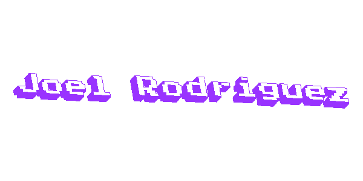

# 👋 Hi there! / ¡Hola!

### About Me / Sobre Mí
I'm Joel René Rodríguez Rubio, a recent Systems Engineering graduate from The National Autonomous University of Honduras, passionate about programming and problem-solving.

### 🚀 Tech Stack / Tecnologías
#### Frontend

#### Backend

#### Databases

### 🌟 Current Projects / Proyectos Actuales
- Church Certificate Management System
- Custom Reporting Generator
- Various SaaS Solutions
- Automation Scripts and Tools

### 🎯 Goals / Objetivos
Continuously learn and grow as a developer, gaining new experiences in technology and software development.

## 🇪🇸 Versión en Español

### Sobre Mí / About Me
Soy Joel René Rodríguez Rubio, un estudiante recién egresado de ingeniería en sistemas apasionado por la programación y la resolución de problemas.

Me considero una persona centrada en programar, que siempre busca resolver los problemas que se me presenten y me inspiro en el arte y los conceptos de UI.

### 🌟 Proyectos Actuales / Current Projects
- Sistema de gestión de constancias para iglesia
- Generador de reportería personalizada
- Diversas soluciones SaaS
- Scripts de automatización

### 🎯 Objetivos / Goals
Trabajar para aprender, adquirir nuevas experiencias como desarrollador y adentrarme más en el mundo del desarrollo y la tecnología.

### 📫 Contact / Contacto

